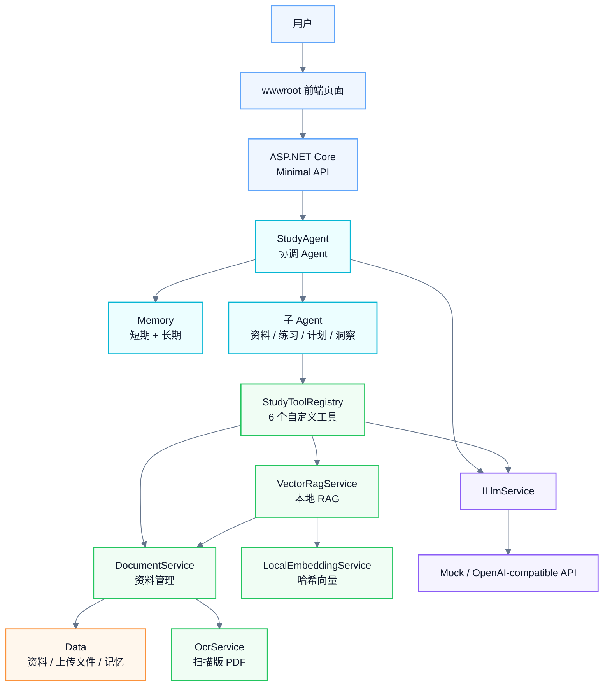
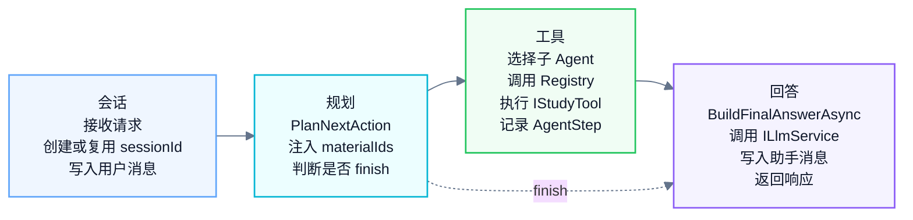
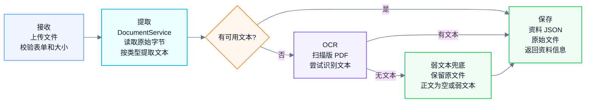
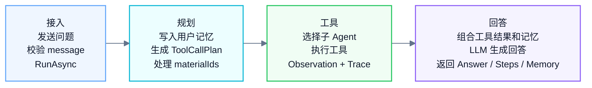

# SmartStudyAgent

SmartStudyAgent 是一个基于 .NET 8 的智能学习助手 Agent 系统。它面向资料学习场景，支持上传 PDF、PPTX、TXT、Markdown 等学习资料，并通过 Agent 完成资料检索、内容总结、练习题生成、学习计划制定、知识点整理和多轮问答。

系统围绕“资料管理 + 智能问答 + 学习辅助”设计：后端负责文件解析、资料存储、Agent 编排、工具调用、RAG 检索和大模型交互；前端负责资料上传、预览、聊天、流式回答和执行轨迹展示。

## 功能概览

- 资料管理：上传、预览、重命名、删除课程资料，支持原始文件预览或下载。
- 文本提取：支持 `.pdf`、`.pptx`、`.txt`、`.md`，扫描版 PDF 可选使用 OCR。
- 智能问答：围绕已上传资料回答用户问题，并返回 Agent 执行步骤。
- RAG 检索：使用本地轻量向量检索，从资料中找到相关片段作为回答依据。
- 自定义工具：内置资料检索、资料总结、练习题生成、学习计划、资料列表、学习重点提取 6 个工具。
- 多 Agent 协作：由 `StudyAgent` 协调多个子 Agent，按任务类型委托执行。
- 记忆机制：支持短期对话记忆和长期学习偏好记忆。
- 流式输出：提供普通问答接口和 Server-Sent Events 流式问答接口。
- Mock 模式：没有真实 API Key 时，也可以演示完整 Agent 流程。

## 小组分工

本项目为个人完成项目。

| 学号 | 姓名 | 分工 |
| --- | --- | --- |
| 2256222 | 陈晓英 | 负责项目选题、需求分析、系统设计、后端 Agent 与工具调用实现、资料上传与 OCR/RAG 能力接入、前端页面开发、测试验证、README 与架构/反思文档编写。 |

## 技术栈

| 分类 | 技术 |
| --- | --- |
| Runtime | .NET 8 |
| Web 框架 | ASP.NET Core Minimal API |
| 语言 | C# |
| 异步模型 | async / await |
| 前端 | HTML / CSS / JavaScript |
| LLM 接入 | OpenAI-compatible Chat Completions API |
| HTTP 客户端 | HttpClient |
| 依赖注入 | ASP.NET Core Dependency Injection |
| 数据存储 | 本地 JSON 文件 |
| RAG | 本地哈希向量 + 余弦相似度 |
| OCR | Tesseract + Poppler / MuPDF，按需安装 |

## 系统架构



整体调用链分为三层：

1. 接入层：`Program.cs` 注册依赖、配置中间件，并暴露 API 路由。
2. 编排层：`StudyAgent` 负责 Agent Loop、工具规划、子 Agent 委托和最终回答生成。
3. 能力层：`Tools` 和 `Services` 负责资料处理、检索、OCR、记忆和 LLM 调用。

## 目录结构

```text
SmartStudyAgent
├─ Agents/                 # Agent 协调器和多个子 Agent
├─ Data/                   # 本地运行数据，包含资料、原始上传文件和记忆文件
├─ docs/                   # 架构、OCR 等补充文档
├─ Memory/                 # 短期记忆和长期记忆实现
├─ Models/                 # API 请求响应、资料、工具调用等模型
├─ Services/               # LLM、资料存储、OCR、Embedding、RAG 等服务
├─ tests/                  # 冒烟测试脚本
├─ Tools/                  # Agent 可调用的自定义工具
├─ wwwroot/                # 静态前端页面
├─ Program.cs              # 应用入口、依赖注入和 API 路由
├─ SmartStudyAgent.csproj  # .NET 8 项目文件
├─ appsettings.json        # 默认配置
└─ README.md
```

## 核心模块

### Program.cs

`Program.cs` 是应用入口，主要负责：

- 配置 Kestrel 上传大小限制。
- 配置 multipart 表单上传限制。
- 注册 CORS、静态文件和默认文件。
- 注册 LLM、Memory、Document、OCR、RAG、Tool、Agent 等服务。
- 暴露资料管理、Agent 问答、记忆管理、OCR 状态等 API。

当前上传大小上限为 `100 MB`。

### StudyAgent

`Agents/StudyAgent.cs` 是 Agent 编排核心。一次问答的大致流程如下：



当前工具规划使用轻量规则实现，优势是稳定、可解释、易调试。真实回答生成仍然通过 `ILlmService` 完成。

### 子 Agent

| 子 Agent | 文件 | 职责 |
| --- | --- | --- |
| `MaterialAgent` | `Agents/MaterialAgent.cs` | 资料列表、资料检索、资料总结 |
| `PracticeAgent` | `Agents/PracticeAgent.cs` | 练习题、答案和解析生成 |
| `PlanningAgent` | `Agents/PlanningAgent.cs` | 学习计划制定 |
| `InsightAgent` | `Agents/InsightAgent.cs` | 关键词、知识点、复习提纲和易错点提取 |

子 Agent 不重复实现业务能力，而是通过统一的 `StudyToolRegistry` 调用工具。这样可以把“任务分派”和“工具执行”分开，降低耦合。

### 自定义工具

| 工具名 | 文件 | 功能 |
| --- | --- | --- |
| `list_materials` | `Tools/MaterialListTool.cs` | 列出已上传资料 |
| `search_materials` | `Tools/DocumentSearchTool.cs` | 检索资料并返回相关片段 |
| `summarize_material` | `Tools/MaterialSummaryTool.cs` | 总结指定资料或全部资料 |
| `generate_quiz` | `Tools/QuizTool.cs` | 根据资料生成练习题、答案和解析 |
| `create_study_plan` | `Tools/StudyPlanTool.cs` | 根据学习目标生成学习计划 |
| `extract_learning_points` | `Tools/LearningInsightTool.cs` | 提取关键词、知识点、复习提纲和易错点 |

工具统一实现 `IStudyTool` 接口，并返回 `ToolExecutionResult`。工具的返回内容会进入 Agent 执行轨迹，也会作为最终回答的重要上下文。

### 资料服务

`Services/DocumentService.cs` 负责资料的生命周期管理：

- 保存手动输入的文本资料。
- 保存上传的原始文件。
- 调用 `DocumentTextExtractor` 提取正文。
- 在普通文本提取失败时尝试 OCR。
- 列出资料、读取预览、读取原始文件。
- 根据标题或 ID 查找资料。
- 构建供 LLM 使用的资料语料。
- 删除资料和对应原始文件。

资料元数据和提取文本保存为 JSON 文件，原始上传文件单独保存，便于预览和下载。

### RAG 服务

RAG 相关实现由两个服务组成：

- `LocalEmbeddingService`：把文本切分成中英文 token，并用固定维度哈希向量表示文本。
- `VectorRagService`：把资料正文切块，对问题和片段分别计算向量，再用余弦相似度排序。

默认切块参数：

- chunk size：`700`
- overlap：`120`

这个方案不依赖外部向量数据库，适合轻量资料问答和本地运行。对于大规模知识库，可以在该层替换为专业向量数据库。

### LLM 服务

`Services/OpenAiCompatibleLlmService.cs` 通过 `ILlmService` 暴露统一接口：

```csharp
Task<string> CompleteAsync(string systemPrompt, string userPrompt, CancellationToken cancellationToken);
```

支持两种模式：

- `Mock`：不访问外部网络，返回可演示流程的本地回答。
- `OpenAI`：调用 OpenAI-compatible Chat Completions API。

真实 API 调用失败时，服务会记录日志并回退到 Mock 响应，保证系统基本流程可用。

### Memory

| 模块 | 文件 | 存储内容 |
| --- | --- | --- |
| 短期记忆 | `Memory/ConversationMemory.cs` | 按 `sessionId` 保存用户和助手消息 |
| 长期记忆 | `Memory/LongTermMemoryStore.cs` | 保存学习目标和学习偏好 |

短期记忆用于多轮对话上下文，长期记忆用于保存跨对话的学习设定。两者都保存到本地 JSON 文件中。

## 请求处理流程

### 上传资料



### Agent 问答



## 数据存储

运行时数据默认保存在 `Data` 目录下：

```text
Data
├─ Materials/      # 资料元数据和提取后的正文 JSON
├─ Uploads/        # 原始上传文件
├─ Memory/         # conversation-memory.json 和 long-term-memory.json
└─ OcrTemp/        # OCR 临时文件
```

`Data/` 已在 `.gitignore` 中忽略，避免把用户上传资料和本地记忆提交到仓库。

## 配置说明

默认配置位于 `appsettings.json`：

```json
{
  "Llm": {
    "Provider": "Mock",
    "BaseUrl": "https://api.vectorengine.ai/v1",
    "Endpoint": "",
    "Model": "gpt-4o-mini",
    "ApiKey": ""
  }
}
```

配置优先级遵循 ASP.NET Core 默认规则。常见覆盖方式：

1. `appsettings.json`
2. `appsettings.Development.json`
3. 环境变量

使用 `dotnet run --launch-profile http` 时，项目会进入 `Development` 环境。如果本地存在 `appsettings.Development.json`，它会覆盖 `appsettings.json`。该文件已在 `.gitignore` 中忽略，适合保存本机开发配置，但不建议保存可泄露的真实密钥。

### LLM 配置项

| 配置项 | 说明 |
| --- | --- |
| `Llm:Provider` | `Mock` 或 `OpenAI` |
| `Llm:BaseUrl` | OpenAI-compatible API 基础地址 |
| `Llm:Endpoint` | 完整 chat completions 地址；配置后优先使用 |
| `Llm:Model` | 模型名称 |
| `Llm:ApiKey` | API Key |

推荐使用环境变量配置真实模型：

```powershell
$env:Llm__Provider="OpenAI"
$env:Llm__BaseUrl="https://api.vectorengine.ai/v1"
$env:Llm__Model="gpt-4o-mini"
$env:Llm__ApiKey="你的 API Key"
dotnet run --launch-profile http
```

也可以直接配置完整 Endpoint：

```powershell
$env:Llm__Provider="OpenAI"
$env:Llm__Endpoint="https://api.vectorengine.ai/v1/chat/completions"
$env:Llm__Model="gpt-4o-mini"
$env:Llm__ApiKey="你的 API Key"
dotnet run --launch-profile http
```

## 构建和运行

### 环境要求

- .NET SDK 8.0 或更高版本
- Windows、macOS 或 Linux
- 可选：Tesseract OCR 和 Poppler / MuPDF

检查 .NET 版本：

```powershell
dotnet --version
```

### 还原依赖

```powershell
dotnet restore
```

### 构建项目

```powershell
dotnet build
```

如果构建时提示 `SmartStudyAgent.dll` 被占用，通常是旧的后端进程还在运行。停止旧进程后重新执行构建即可。

### 启动服务

```powershell
dotnet run --launch-profile http
```

启动后访问：

```text
http://localhost:5153
```

`http` profile 定义在 `Properties/launchSettings.json` 中，默认监听 `http://localhost:5153`。

### 使用独立 CLI 目录

如果本机 dotnet 首次运行体验或权限影响开发，可以指定本地 CLI 目录：

```powershell
$env:DOTNET_CLI_HOME="D:\SmartStudyAgent\.dotnet-home"
$env:DOTNET_SKIP_FIRST_TIME_EXPERIENCE="1"
dotnet run --launch-profile http
```

## OCR

普通文字型 PDF 会优先尝试直接提取文本。扫描版 PDF 或图片型 PDF 需要安装 OCR 工具：

- Tesseract OCR：识别图片文字。
- Poppler `pdftoppm` 或 MuPDF `mutool`：将 PDF 页面渲染成图片。

Windows 安装示例：

```powershell
winget install UB-Mannheim.TesseractOCR
winget install oschwartz10612.Poppler
```

检查 OCR 状态：

```text
http://localhost:5153/api/ocr/status
```

OCR 说明：

- OCR 临时文件保存在 `Data/OcrTemp`。
- 默认优先使用 `chi_sim+eng`，失败时回退到 `eng`。
- OCR 最多处理前 20 页，避免超大 PDF 导致请求等待太久。
- 如果 OCR 工具不可用，系统仍会保存原始文件，但无法基于扫描图片内容准确问答。

更详细说明见 `docs/ocr.md`。

## API

### 路由列表

| 方法 | 路由 | 说明 |
| --- | --- | --- |
| `GET` | `/api/info` | 服务基本信息 |
| `GET` | `/api/materials` | 资料列表 |
| `POST` | `/api/materials` | 手动添加文本资料 |
| `POST` | `/api/materials/upload` | 上传文件资料 |
| `GET` | `/api/materials/{id}` | 查看资料预览 |
| `GET` | `/api/materials/{id}/file` | 预览或下载原始文件 |
| `PUT` | `/api/materials/{id}` | 修改资料标题 |
| `DELETE` | `/api/materials/{id}` | 删除资料 |
| `GET` | `/api/ocr/status` | 查看 OCR 环境状态 |
| `POST` | `/api/agent/chat` | 普通 Agent 问答 |
| `POST` | `/api/agent/chat/stream` | 流式 Agent 问答 |
| `GET` | `/api/sessions` | 会话列表 |
| `GET` | `/api/memory/{sessionId}` | 读取短期记忆 |
| `DELETE` | `/api/memory/{sessionId}` | 清空短期记忆 |
| `GET` | `/api/long-term-memory/{sessionId}` | 读取长期记忆 |
| `PUT` | `/api/long-term-memory/{sessionId}` | 更新长期记忆 |

### 查看服务信息

```powershell
Invoke-RestMethod http://localhost:5153/api/info
```

### 查看资料列表

```powershell
Invoke-RestMethod http://localhost:5153/api/materials
```

### 手动添加文本资料

```powershell
Invoke-RestMethod `
  -Method Post `
  -Uri http://localhost:5153/api/materials `
  -ContentType "application/json" `
  -Body '{"title":"示例资料","content":"这是一个用于测试的课程资料。"}'
```

### 上传文件资料

```powershell
Invoke-RestMethod `
  -Method Post `
  -Uri http://localhost:5153/api/materials/upload `
  -Form @{ file = Get-Item ".\sample.pdf"; title = "示例 PDF" }
```

### 和 Agent 对话

```powershell
Invoke-RestMethod `
  -Method Post `
  -Uri http://localhost:5153/api/agent/chat `
  -ContentType "application/json" `
  -Body '{"message":"请总结刚上传的课程资料","sessionId":"demo","maxSteps":5}'
```

响应中包含：

- `sessionId`：会话 ID。
- `answer`：最终回答。
- `steps`：Agent 执行步骤。
- `memory`：当前会话记忆。

### 流式问答

`POST /api/agent/chat/stream` 使用 Server-Sent Events 返回：

- `steps`：Agent 执行轨迹。
- `answer`：分片回答内容。
- `done`：结束标记。

前端页面已接入该接口，用于边生成边展示回答。

### 读取会话记忆

```powershell
Invoke-RestMethod http://localhost:5153/api/memory/demo
```

### 更新长期记忆

```powershell
Invoke-RestMethod `
  -Method Put `
  -Uri http://localhost:5153/api/long-term-memory/demo `
  -ContentType "application/json" `
  -Body '{"learningGoal":"复习 .NET Agent 开发","preference":"希望用步骤化中文解释"}'
```

## 测试

项目提供基础冒烟测试脚本，用来验证核心接口是否可用。

先启动后端：

```powershell
dotnet run --launch-profile http
```

另开一个 PowerShell 窗口运行：

```powershell
powershell -ExecutionPolicy Bypass -File .\tests\smoke-test.ps1
```

脚本会检查：

- `/api/info`
- `/api/materials`
- `/api/agent/chat`

## 开发约定

- API Key 使用环境变量或本地未提交配置，不写入源代码。
- `Data/`、`bin/`、`obj/`、`.dotnet-home/` 和本地构建输出目录不提交。
- 新增工具时实现 `IStudyTool`，再在 `StudyToolRegistry` 和 DI 容器中注册。
- 新增子 Agent 时实现 `IStudySubAgent`，并在 `Program.cs` 中注册。
- 涉及资料读取、文件上传、LLM 调用的逻辑应保持异步。
- 工具返回内容应尽量结构化，方便进入 `AgentStep` 和最终回答上下文。

## 排障

### 构建时 DLL 被占用

现象：

```text
The process cannot access the file 'SmartStudyAgent.dll' because it is being used by another process.
```

处理方式：

- 如果项目正在终端运行，按 `Ctrl + C` 停止。
- 如果后台仍有旧进程，结束对应的 `.NET Host` 进程后重新构建。

### 上传扫描版 PDF 后无法问答

可能原因：

- PDF 是图片扫描件，没有可直接提取的文本层。
- 本机没有安装 Tesseract。
- 本机没有安装 Poppler 或 MuPDF。
- 缺少中文 OCR 语言包。

可以先访问：

```text
http://localhost:5153/api/ocr/status
```

### 真实模型没有生效

检查项：

- `Llm:Provider` 是否为 `OpenAI`。
- `Llm:BaseUrl` 或 `Llm:Endpoint` 是否正确。
- `Llm:Model` 是否填写。
- `Llm:ApiKey` 是否有效。
- `appsettings.Development.json` 或环境变量是否覆盖了预期配置。

