# SmartStudyAgent 架构设计文档

## 1. 项目定位

SmartStudyAgent 是一个基于 .NET 8 的智能学习助手 Agent 系统。系统围绕资料学习场景设计，支持用户上传学习资料，并通过 Agent 完成资料检索、总结、出题、学习计划制定、知识点整理和多轮问答。

项目的核心目标是把“LLM 语言生成能力”和“本地资料处理能力”结合起来。LLM 不直接凭空回答，而是先通过 Agent Loop 调用工具获取资料、记忆和检索结果，再生成最终回答。

## 2. 总体架构

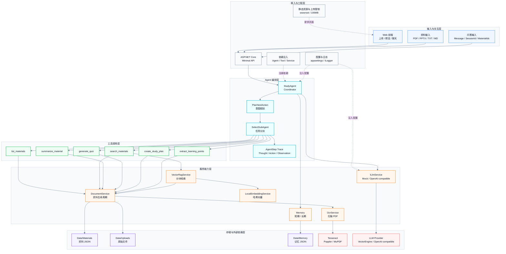

这张图按请求从上到下的执行路径组织。横向模块表示同一阶段中的并列能力，纵向箭头表示一次用户请求从前端进入系统后，经过 API、Agent 编排、工具调用、服务能力，最终落到本地存储或外部模型服务。

整体架构分为 6 层，层级和核心组件如下：

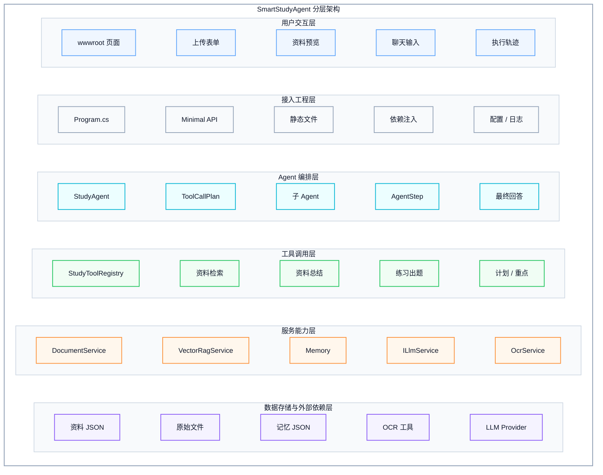

各层职责说明如下：

| 层级 | 主要模块 | 作用 |
| --- | --- | --- |
| 用户交互层 | `wwwroot`、上传表单、聊天输入、执行轨迹展示 | 提供资料上传、资料预览、聊天、流式回答和执行轨迹展示 |
| 接入工程层 | `Program.cs`、DI、配置、日志 | 注册服务、配置中间件、暴露 HTTP API，并统一管理运行时依赖 |
| Agent 编排层 | `StudyAgent`、`ToolCallPlan`、子 Agent、`AgentStep` | 负责推理流程、工具规划、任务分派、执行轨迹记录和最终回答生成 |
| 工具调用层 | `Tools`、`StudyToolRegistry` | 把用户意图映射到具体工具，统一执行资料检索、总结、出题、计划和知识点整理 |
| 服务能力层 | `Services`、`Memory`、`ILlmService` | 提供资料解析、RAG、OCR、记忆读写和大模型调用等可复用能力 |
| 数据存储与外部依赖层 | `Data`、OCR 工具、LLM Provider | 保存资料、原始文件和记忆，并连接 Tesseract、Poppler/MuPDF、OpenAI-compatible 服务 |

## 3. 核心组件设计

### 3.1 API 入口

`Program.cs` 是项目入口，负责：

- 配置上传大小限制，当前上限为 `100 MB`。
- 配置 CORS、静态文件和默认首页。
- 注册核心服务：LLM、Memory、Document、OCR、Embedding、RAG。
- 注册 6 个工具和 4 个子 Agent。
- 暴露资料、Agent、记忆和 OCR 相关 API。

主要接口包括：

| 接口 | 作用 |
| --- | --- |
| `GET /api/info` | 获取服务信息 |
| `GET /api/materials` | 获取资料列表 |
| `POST /api/materials/upload` | 上传文件资料 |
| `POST /api/agent/chat` | 普通 Agent 问答 |
| `POST /api/agent/chat/stream` | 流式 Agent 问答 |
| `GET /api/memory/{sessionId}` | 读取短期记忆 |
| `PUT /api/long-term-memory/{sessionId}` | 更新长期记忆 |
| `GET /api/ocr/status` | 查看 OCR 环境状态 |

### 3.2 Agent 编排层

`StudyAgent` 是系统的 Coordinator Agent，负责：

- 接收用户请求。
- 创建或复用会话 ID。
- 写入短期记忆。
- 根据用户问题生成 `ToolCallPlan`。
- 选择合适的子 Agent。
- 执行工具并收集 Observation。
- 调用 LLM 生成最终回答。
- 写入助手消息并返回 `AgentChatResponse`。

`AgentChatResponse` 包含：

- `SessionId`：会话 ID。
- `Answer`：最终回答。
- `Steps`：Agent 执行轨迹。
- `Memory`：当前会话记忆。

### 3.3 子 Agent 设计

项目使用一个协调 Agent 加多个子 Agent 的结构：

| 子 Agent | 负责工具 | 职责 |
| --- | --- | --- |
| `MaterialAgent` | `list_materials`、`search_materials`、`summarize_material` | 资料列表、资料检索、资料总结 |
| `PracticeAgent` | `generate_quiz` | 根据资料生成练习题、答案和解析 |
| `PlanningAgent` | `create_study_plan` | 根据学习目标制定学习计划 |
| `InsightAgent` | `extract_learning_points` | 提取关键词、知识点、复习提纲和易错点 |

子 Agent 统一实现 `IStudySubAgent`：

```csharp
public interface IStudySubAgent
{
    string Name { get; }
    string Description { get; }
    bool CanHandle(string toolName);
    Task<ToolExecutionResult> ExecuteAsync(ToolCallPlan plan, CancellationToken cancellationToken);
}
```

子 Agent 的作用不是直接生成回答，而是根据自己的职责执行对应工具。这样可以把“任务分派”和“工具执行”拆开，后续扩展新任务时结构更清晰。

## 4. Agent 架构图

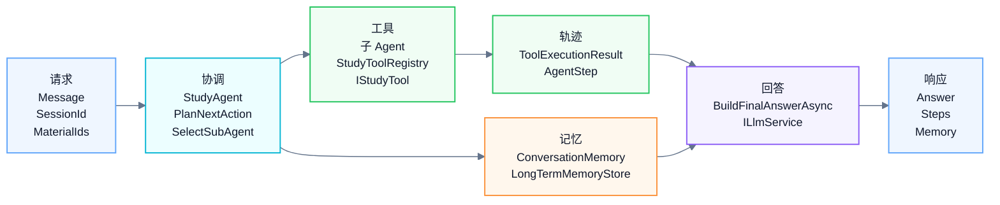

这个架构体现了三个关键点：

1. `StudyAgent` 不直接做所有业务，而是负责编排。
2. 子 Agent 根据工具名分工，避免所有任务堆在一个类里。
3. 工具执行结果会保存为 `AgentStep`，前端可以展示推理轨迹。

## 5. 推理流程图

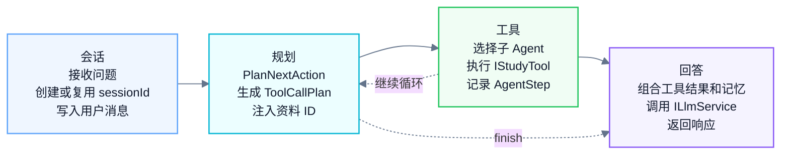

当前实现是轻量 ReAct 流程。工具选择由 `PlanNextAction` 的规则规划器完成，工具调用完成后通常停止继续调用，进入最终回答阶段。

## 6. 工具设计

### 6.1 工具接口

所有工具统一实现 `IStudyTool`：

```csharp
public interface IStudyTool
{
    string Name { get; }
    string Description { get; }
    Task<ToolExecutionResult> ExecuteAsync(
        IReadOnlyDictionary<string, string> arguments,
        CancellationToken cancellationToken);
}
```

接口设计含义：

- `Name`：工具唯一名称，Agent 根据它调用工具。
- `Description`：工具能力描述，便于展示和提示。
- `ExecuteAsync`：工具执行入口，接收参数并返回观察结果。

工具返回统一模型 `ToolExecutionResult`：

```csharp
public sealed record ToolExecutionResult(
    string ToolName,
    string Observation);
```

`Observation` 会进入 Agent 执行轨迹，也会作为最终回答的上下文。

### 6.2 工具注册表

`StudyToolRegistry` 负责统一保存和执行工具：

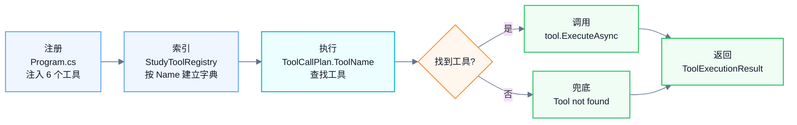

这种设计避免 Agent 直接依赖具体工具类。新增工具时，只需要实现 `IStudyTool`，并在 DI 容器和 `StudyToolRegistry` 中注册。

### 6.3 工具清单

| 工具名 | 文件 | 输入参数 | 输出 | 作用 |
| --- | --- | --- | --- | --- |
| `list_materials` | `MaterialListTool.cs` | 无 | 资料列表文本 | 查看当前已有资料 |
| `search_materials` | `DocumentSearchTool.cs` | `query`、可选 `materialIds` | 相关资料片段 | 围绕资料回答问题 |
| `summarize_material` | `MaterialSummaryTool.cs` | `target`、可选 `materialIds` | 总结内容 | 总结单份或多份资料 |
| `generate_quiz` | `QuizTool.cs` | `query`、可选 `materialIds` | 题目、答案、解析 | 生成练习题 |
| `create_study_plan` | `StudyPlanTool.cs` | `goal`、可选 `materialIds` | 学习计划 | 制定学习安排 |
| `extract_learning_points` | `LearningInsightTool.cs` | `goal`、可选 `materialIds` | 关键词、知识点、提纲 | 学习重点整理 |

### 6.4 工具分派关系

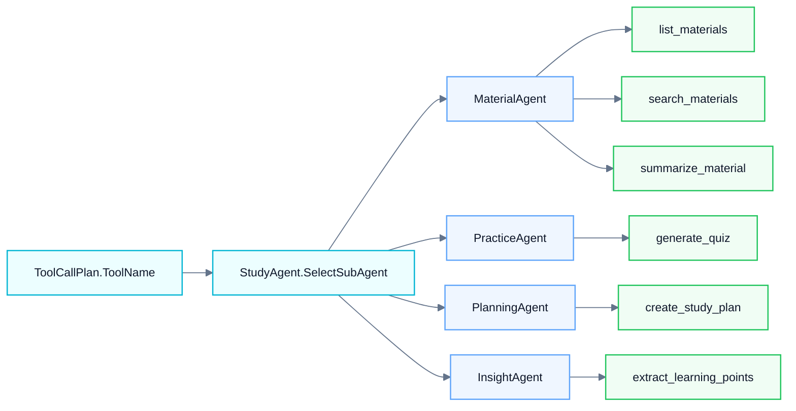

## 7. RAG 架构

本项目实现轻量本地 RAG，不依赖外部向量数据库。

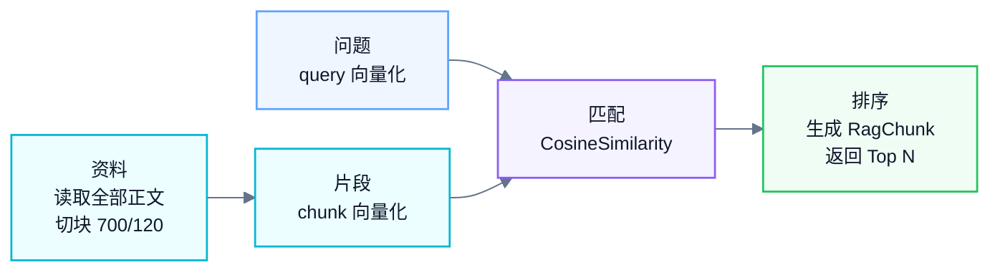

RAG 检索在 `search_materials` 工具中使用。检索策略为：

1. 如果用户显式选择资料，优先读取选中资料。
2. 如果问题中匹配到资料标题，优先返回该资料片段。
3. 如果没有精确匹配，使用 `VectorRagService` 做向量检索。
4. 如果 RAG 没有命中，再退回到关键词检索。

## 8. 资料处理架构

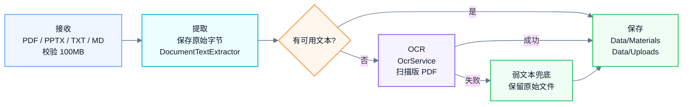

资料数据分两部分保存：

| 目录 | 内容 |
| --- | --- |
| `Data/Materials` | 资料 ID、标题、提取文本、文件类型、创建时间等 JSON 元数据 |
| `Data/Uploads` | 用户上传的原始文件 |

这样既可以让 Agent 读取提取文本，也可以让前端预览或下载原始文件。

## 9. 记忆架构

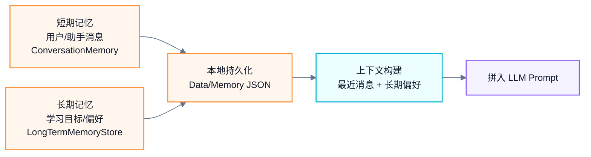

记忆分为两类：

| 类型 | 实现 | 用途 |
| --- | --- | --- |
| 短期记忆 | `ConversationMemory` | 保存当前会话最近消息，用于多轮追问 |
| 长期记忆 | `LongTermMemoryStore` | 保存学习目标和学习偏好，影响回答风格和重点 |

## 10. LLM 调用架构

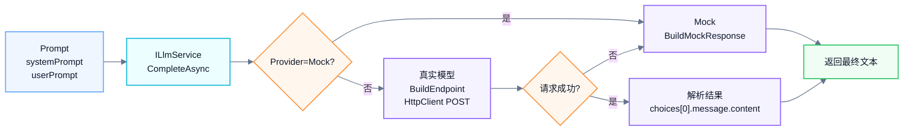

`OpenAiCompatibleLlmService` 的设计重点：

- 用 `ILlmService` 抽象模型调用，降低业务层对具体模型服务的依赖。
- 支持 `Mock` 模式，保证无 API Key 时仍可运行。
- 支持 OpenAI-compatible API，便于接入不同模型平台。
- 调用失败时记录日志并回退 Mock，避免整个 Agent 流程中断。

## 11. 数据模型关系

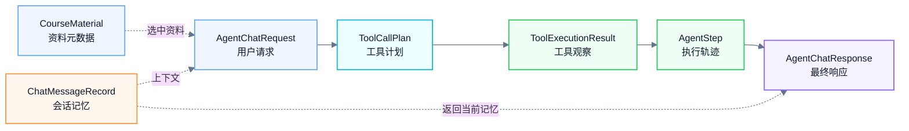

这些模型把一次 Agent 交互拆成请求、计划、工具结果、执行步骤和最终响应。为了避免导出 PDF 时类图过高导致分页，这里用横向数据流图表达模型关系，字段细节放在下表中说明。

| 模型 | 关键字段 | 作用 |
| --- | --- | --- |
| `CourseMaterial` | `Id`、`Title`、`FileName`、`FileType`、`CharacterCount`、`FileSize`、`CreatedAt` | 保存资料元数据，支持资料选择、预览和检索 |
| `AgentChatRequest` | `Message`、`SessionId`、`MaxSteps`、`MaterialIds` | 表示一次用户问答请求 |
| `ToolCallPlan` | `Thought`、`ToolName`、`Arguments` | 表示 Agent 对下一步工具调用的规划 |
| `ToolExecutionResult` | `ToolName`、`Observation` | 表示工具执行后的观察结果 |
| `AgentStep` | `Step`、`Thought`、`Action`、`Observation`、`Agent` | 表示前端可展示的一步执行轨迹 |
| `AgentChatResponse` | `SessionId`、`Answer`、`Steps`、`Memory` | 表示最终返回给前端的回答、步骤和记忆 |

## 12. 设计取舍

### 12.1 规则规划器 vs LLM Function Calling

当前 `PlanNextAction` 使用关键词规则选择工具。优点是稳定、简单、可解释；缺点是表达覆盖有限。后续可以替换为 LLM Function Calling 或 Semantic Kernel Plugin，但当前结构已经保留了 `ToolCallPlan` 和工具注册表，迁移成本较低。

### 12.2 本地 RAG vs 向量数据库

项目使用本地哈希向量和余弦相似度实现轻量 RAG。优点是不依赖外部服务，部署简单；缺点是语义表达能力不如专业 Embedding 模型和向量数据库。对于资料量较小的学习场景，这个方案足够演示 RAG 核心流程。

### 12.3 JSON 文件 vs 数据库

资料和记忆使用本地 JSON 文件保存。优点是开发简单、便于查看和调试；缺点是并发能力和查询能力有限。若部署到多用户环境，应改为数据库存储。

### 12.4 Mock 兜底 vs 强依赖真实模型

项目保留 Mock 模式，可以在没有 API Key 或模型服务不可用时继续演示 Agent Loop、工具调用和记忆机制。真实模型失败时回退 Mock，也能提升系统稳定性。

## 13. 可扩展方向

- 将 `PlanNextAction` 替换为真正的 LLM Function Calling。
- 将 `LocalEmbeddingService` 替换为真实 Embedding 模型。
- 将本地 RAG 替换为 Qdrant、Milvus、pgvector 等向量数据库。
- 将本地 JSON 存储迁移到 SQLite、PostgreSQL 或其他数据库。
- 为工具层和服务层补充单元测试。
- 增加用户认证、权限控制和多用户资料隔离。
